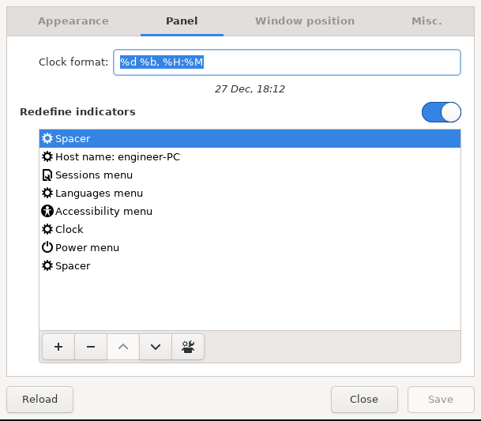

# J0eii Hex Workstation Setup

## System Configs

```
OS: Ubuntu 20.04.1 LTS x86_64
Host: B250-HD3
Kernel: 5.4.0-56-generic
Uptime: 27 mins
Packages: 2083 (dpkg), 7 (snap)
Shell: zsh 5.8
WM: awesome
Theme: Greybird [GTK3]
Icons: elementary-xfce-darker [GTK3]
Terminal: HyperTerm
Terminal Font: Hack
CPU: Intel i7-7700 (8) @ 4.200GHz
GPU: NVIDIA GeForce GTX 1050 Ti (Gigabyte G1 Gaming)
GPU: NVIDIA GeForce GTX 1050    (Gigabyte G1 Gaming)
Memory: 5530MiB / 32076MiB
```

## Perpherials

- Kensington Slimblade
- JBL Pebbles
- HHKB

__Monitors__
  - 24" 1920x1080 x 4
  - 32" 2560x1440 x 2

## Displays Card Config

### Display Map

| 24 | 32 | 24 |
|:-:|:-:|:-:|
| 24 | 32 | 24 |

- NVIDIA GeForce GTX 1050
   - 24"(HDMI)-32"(DVI)-34"(HDMI)
- NVIDIA GeForce GTX 1050 Ti
   - 24"(HDMI)-32"(DVI)-34"(HDMI)

## Features

### Software

- NVim
  - Plugging to original vim
  - fix the vim <-> tmux <-> system clipboard sometimes broken issue
- Vim
  - Mouse support
  - system-wide clipboard support
- Tmux
  - mouse & color support
- fcitx
  - Chinese Input in Awesome WM
  - Quick Table (You may install your own preferences)
- Intellj ideavim
  - Arrow key support
  - Shortcut for __;__ to __:__
  - Ruler
  - Systemwide clipboard support
- Zsh
  - add antigen and custom alias
   - add git, command-not-found, docker, auto completions plugin
   - by default it use powerlevel9k theme
  - l = ls -la
  - c = clear
  - pbcopy = copy stdoutput to systemwide clipboard
  - pbpaste = reverse pbcopy
  - ll = ls -laf
  - gaa = git add .
  - gc = git commit
 - xfce Terminal
  - load a few themes from [bas16-xfce4-terminal](https://github.com/afq984/base16-xfce4-terminal)
 - feh (= MacOS space key to preview image file)
  - change to default size as 500x500
  - auto scale and zoom to prevent over zoomed

### Hardware

- Kensington Slimblade
  - Fix top left button middle click is not working issue
  - Add a new feature to top left button, you can now perform a 4-way scrolling via clicking top-left btn at the sametime
- JBL Pebbles
  - Add __vol-up.sh__ & __vol-down.sh__ for cli/hot keys config to toggle volume
- Apple Magic Trackpad v2 (2015)
  - Check the configs in .apple-magictrackpad-confs

## Installation

### Global Configs

git clone this repository and copy stuff that only you need in your home directory.

clone this repository as follows:

```bash
git clone --recursive https://github.com/j0eii/dotfiles.git

sudo apt install compton 
sudo apt install fcitx fcitx-table-quick-classic
```

You also need to install [__Hack Nerd Font__](https://www.nerdfonts.com/font-downloads) and [__Hack Font__](https://sourcefoundry.org/hack/).

### Hardware

#### Nvidia Xinerama Setup

You need to custom config it yourself. Different hardware requires different setup.

```
cat dotfiles/.x11-confs/xorg.conf.xinerama
sudo nvidia-settings # Config
sudo service lightdm restart # Restart display manager
```

#### Kensington Slimblade

```
sudo cp dotfiles/.x11-confs/10-slimblade.conf /usr/share/X11/xorg.conf.d/10-slimblade.conf
reboot
```

#### Apple Magic Trackpad v2 (2015)

```
## you need to reboot to take effects

cp dotfiles/.apple-magictrackpad-confs/local-overrides.quirks /usr/share/libinput/local-overrides.quirks
# Fix pressure problem
cp dotfiles/.apple-magictrackpad-confs/90-magictrackpad.conf /usr/share/X11/xorg.conf.d/90-magictrackpad.conf


## you need to logout to take effects
# Fix sensitivity problem
mkdir -p ~/.config/xfce4/xfconf/xfce-perchannel-xml
cp dotfiles/.config/xfce4/xfconf/xfce-perchannel-xml/pointers.xml ~/.config/xfce4/xfconf/xfce-perchannel-xml/pointers.xml
```

#### Volume Control

```
cp -r dotfiles/.sh-scripts ~
chmod +x ~/.sh-scripts/*.sh

# you may now call it directly to control your speaker volume
# or config hotkeys like this
~/.sh-scripts/.vol-up.sh
~/sh-scripts/.vol-down.sh
```

### Software

#### Tmux

```
cp dotfiles/.tmux.conf ~
```

#### Vim

```
sudo apt install vim-gtk3
cp -r dotfiles/.vim ~
cp dotfiles/.vimrc ~
```

#### Intellj ideavim

```
cp dotfiles/.ideavimrc ~
```

#### NVim
```
sudo apt install neovim
mkdir -p ~/.config/nvim
cp -r dotfiles/.config/nvim/* ~/.config/nvim
```

#### fcitx

```bash
sudo apt install fcitx fcitx-table-quick-classic
mkdir -p ~/.config/fcitx/skin/nord-dark/
fcitx-configtool # change the theme & hotkeys here

# you also need to copy the .xinitrc if you are using awesomeWM
cp dotfiles/.xinitrc ~
reboot #if needed
```

#### Zsh & antigen

install antigen

```
curl -L git.io/antigen > ~/.oh-my-zsh/antigen.zsh
```

install custom config antigen

```
cp dotfiles/.antigenrc ~
cp dotfiles/.zshrc_extends ~
echo "source .zshrc_extends" >> ~/.zshrc
```

### feh

```bash
cp -r dotfiles/.config/feh ~/.config/
```

You may now try to use space key to preview any images in your file manager(My preferences is Thunar), it works like MacOS preview.


#### base Awesome UI via xfce gtk3+ custom themes & icons

Credits
- [mayu_dark_theme](https://www.xfce-look.org/p/1408765/)
- [mc_os_ctlina_xfce_dark](https://www.xfce-look.org/p/1326265/)
- [qogir](https://www.xfce-look.org/search/projectSearchText/qogir)
- [material black blueberry numix flat](https://www.xfce-look.org/p/1333828/)
- [mb pistachio suru glow](https://www.gnome-look.org/p/1333360/)


```
cp -r dotfiles/.themes ~
cp -r dotfiles/.icons ~

sudo apt install lxappearance
lxappearance # config when awesomewm is your current wm
```

#### xfce4 terminal

```bash
mkdir -p ~/.local/share/xfce4/terminal/colorschemes
cp -r dotfiles/.xfce4-colorschemes/*.theme ~/.local/share/xfce4/terminal/colorschemes
```

Then, config in xfce4 terminal perferences > appearances


### Hot fix

Config lightdm-gtk-greeter-settings to make sure you can select the session when its broken.


```bash
sudo lightdm-gtk-greeter-settings
```



### Others

Here are another tools that I install a new linux desktop:

```bash 
sudo apt install tmux 
sudo apt install pfetch
sudo apt install neofetch
sudo apt install polybar
sudo apt install calcurse
sudo apt install evdev
sudo apt install fcitx fcitx-table-quick-classic fcitx-configtool
sudo apt install inkscape
sudo apt install lxappearance
sudo apt install compton
sudo apt install alacritty
sudo apt install python
sudo apt install pip
sudo apt install python-pip
sudo apt install exiftool
sudo apt install tig
sudo apt install neovim
sudo apt install rofi
sudo apt install hollywood
sudo apt install cmatrix
sudo apt install wakeonlan
sudo apt install nmap
sudo apt install dbeaver
sudo apt install unrar
sudo apt install openjdk-11-jre openjdk-11-jdk
sudo apt install kazam
```
